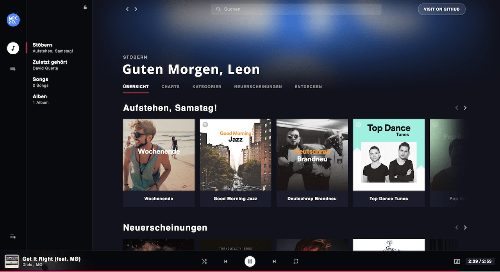
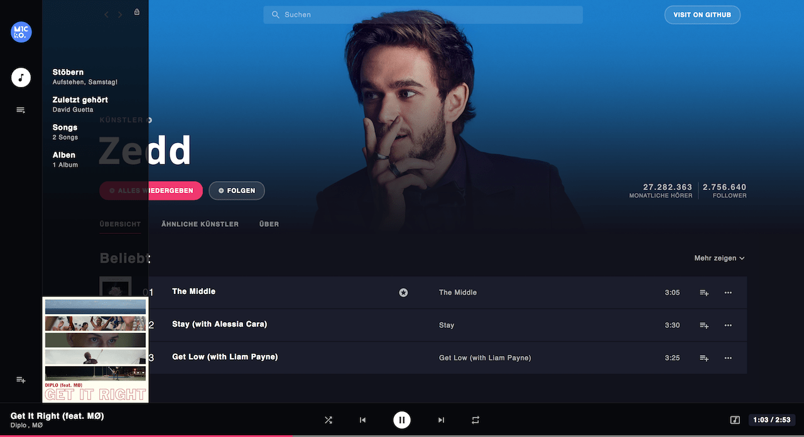
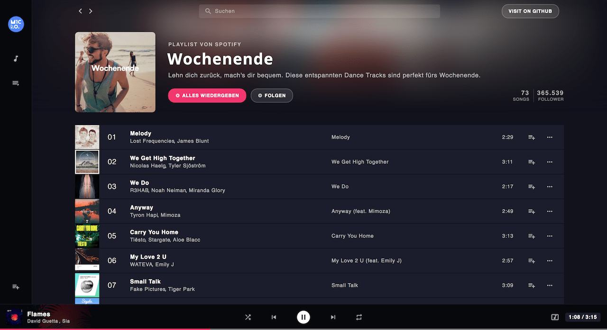

<div align="center">


# 🎵 Music App

### Plataforma de streaming musical desarrollada con Vue.js 🚀

<p align="center">
  <b>Music App</b> es una aplicación moderna de streaming de música construida con 
  <b>Vue.js</b>, <b>Vuex</b>, <b>Webpack</b> y la <b>Spotify API</b>, diseñada para ofrecer una experiencia rápida, elegante y dinámica para explorar música, artistas y playlists.
</p>

<p align="center">
  
  
  
  
</p>

<p align="center">
  <a href="#-preview">Preview</a> •
  <a href="#-características">Características</a> •
  <a href="#-tecnologías-utilizadas">Tecnologías</a> •
  <a href="#-instalación">Instalación</a> •
  <a href="#-roadmap">Roadmap</a>
</p>

</div>

---

# 🌊 Acerca de Music App

**Music App** es una aplicación web inspirada en plataformas modernas de streaming musical como Spotify.

El proyecto fue desarrollado utilizando tecnologías frontend modernas y consume datos musicales mediante la **Spotify API**, permitiendo visualizar:

- 🎵 Canciones
- 🎤 Artistas
- 📂 Playlists
- 🔍 Búsquedas dinámicas
- 🎧 Exploración musical

Aunque el proyecto quedó incompleto, mantiene una arquitectura sólida y una excelente base para continuar el desarrollo.

---

# 📸 Preview

<div align="center">



</div>

---

# 📱 Capturas de Pantalla

<div align="center">





</div>

---

# ✨ Características

## 🎧 Streaming Musical

- 🎵 Exploración de canciones
- 🎤 Vista de artistas
- 📂 Gestión de playlists
- 🔍 Buscador musical
- ⚡ Navegación dinámica
- 🎶 Integración con Spotify API

---

## 🎨 Interfaz Moderna

- ⚡ SPA (Single Page Application)
- 🎨 Diseño inspirado en Spotify
- 📱 Responsive Design
- 🔥 Navegación fluida
- 🌙 Arquitectura escalable

---

## 🚀 Arquitectura Frontend

- ⚡ Vue.js
- 📦 Vuex State Management
- 🛠️ Webpack
- 🌐 Spotify API
- 🔄 Componentes reutilizables

---

# 🛠️ Tecnologías Utilizadas

## 🎨 Frontend

<p>
  
</p>

- Vue.js
- Vuex
- JavaScript
- HTML5
- CSS3
- Webpack

---

## 🌐 API & Servicios

- Spotify Web API
- REST API
- JSON Data Handling

---

## 🧰 Herramientas

<p>
  
</p>

- Git & GitHub
- VS Code
- Node.js
- npm

---

# 📂 Estructura del Proyecto

```bash
music-app/
│
├── src/
│   ├── assets/
│   ├── components/
│   ├── store/
│   ├── views/
│   └── router/
│
├── public/
├── package.json
└── README.md
```

---

# ⚡ Instalación

## 1️⃣ Clonar el repositorio

```bash
git clone https://github.com/microeinhundert/music-app.git
```

---

## 2️⃣ Entrar al proyecto

```bash
cd music-app
```

---

## 3️⃣ Instalar dependencias

```bash
npm install
```

---

# ▶️ Ejecutar Proyecto

## 🚀 Modo Desarrollo

```bash
npm run serve
```

La aplicación estará disponible en:

```bash
http://localhost:8080
```

---

## 📦 Build Producción

```bash
npm run build
```

---

# 🔥 Estado del Proyecto

## ⚠️ Proyecto Incompleto

El desarrollo del proyecto fue detenido antes de finalizar completamente algunas funcionalidades.

Algunas secciones pueden:

- 🚧 Estar incompletas
- ⚠️ Tener errores
- 🔄 Requerir mejoras
- 📦 Necesitar optimización

Sin embargo, sigue siendo una excelente base para proyectos de streaming musical con Vue.js.

---

# 📊 Roadmap

## 🚧 Próximamente

- 🎵 Reproductor musical completo
- ❤️ Sistema de favoritos
- 📂 Playlists personalizadas
- 🔍 Mejoras en búsqueda
- 🌙 Dark Mode
- 📱 Mejor responsive design
- 🔥 Recomendaciones musicales
- ☁️ Autenticación Spotify

---

# 🤝 Contribuciones

Las contribuciones son bienvenidas ❤️

## Pasos para contribuir

1. Haz Fork del proyecto
2. Crea una rama

```bash
git checkout -b feature/nueva-funcion
```

3. Realiza tus cambios
4. Haz commit

```bash
git commit -m "✨ Nueva funcionalidad"
```

5. Haz push

```bash
git push origin feature/nueva-funcion
```

6. Abre un Pull Request 🚀

---

# 👨‍💻 Autor

<div align="center">


## Open Source Developer

Desarrollador apasionado por aplicaciones modernas, streaming multimedia y experiencias web interactivas.

</div>

---

# 🌟 Apoya el Proyecto

Si te gusta Music App:

⭐ Dale una estrella al repositorio  
🍴 Haz Fork del proyecto  
📢 Compártelo con otros desarrolladores

---

# 📜 Licencia

Este proyecto es de código abierto y está disponible bajo licencia MIT.

---

<div align="center">

### 🎶 Music App — Streaming moderno construido con Vue.js.

</div>
